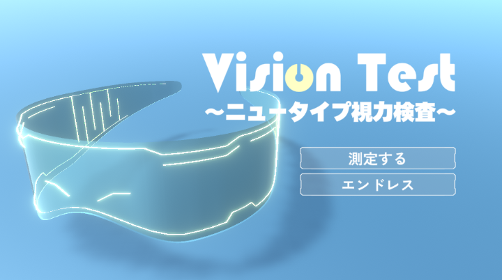
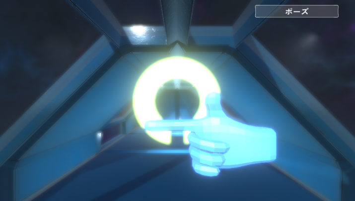

# Vision Test
## Overview
視力検査をモチーフにしたUnityゲーム。  
迫りくるランドルト環と同じ向きに指を指し続けることで判定を行う。

測定モードではリアルタイムで視力値が変化する。

プレイ:https://unityroom.com/games/visiontest#google_vignette

---

## Modes

### Measurement Mode
- 固定回数で測定
- プレイ中に変化する視力に応じて画面の解像度も変化

### Endless Mode
- 失敗するまで継続
- スコア更新型

---

## Environment
- Unity 2022.3 LTS
- Windows

---

## Controls
- キーボードによる方向入力

---

## Dependencies
外部アセットは `Assets/ThirdParty` に格納。

